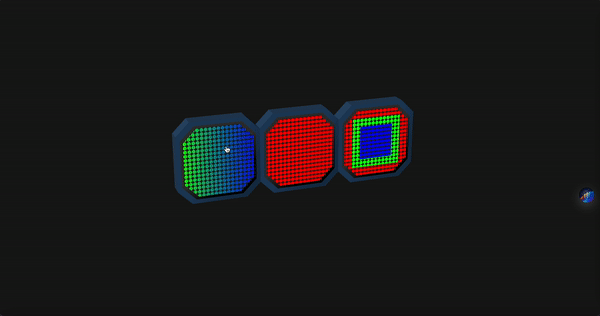

<h1 align='center'>
    
  The CSS Wall
</h1>

  Modular Control Panel build entirely in CSS to showcase cutting-edge CSS properties  
  <strong>App:</strong> <a href="https://csstr.ikbenmel.vin"> https://csstr.ikbenmel.vin </a>  
  <strong>Proces:</strong> <a href="https://csstr.ikbenmel.vin/proces"> https://csstr.ikbenmel.vin/proces </a>

<!-- Stability -->
  
<!-- Standard -->
  
<!-- Commit Activity -->
  
<!-- Last Commit -->
  
<!-- Stars -->
  

 

## Preview 👀 

## How to view properly
In order to view this experimental application properly I highly advice to install a chromium based browser _111.0.1661.27_ or above. (At the time of writing this README this means the most recent DEV version of either Chrome or Edge.)

## Process
Please go to [https://csstr.ikbenmel.vin/proces](https://csstr.ikbenmel.vin/proces) to view my process book.